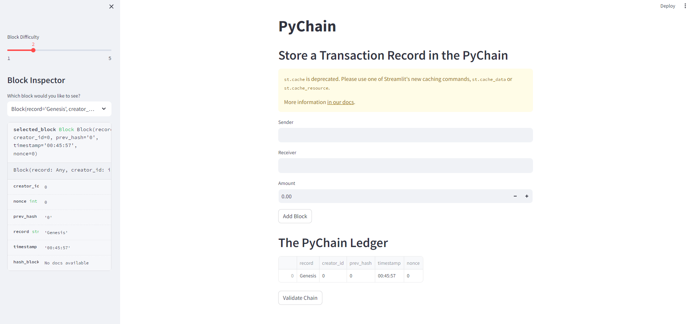
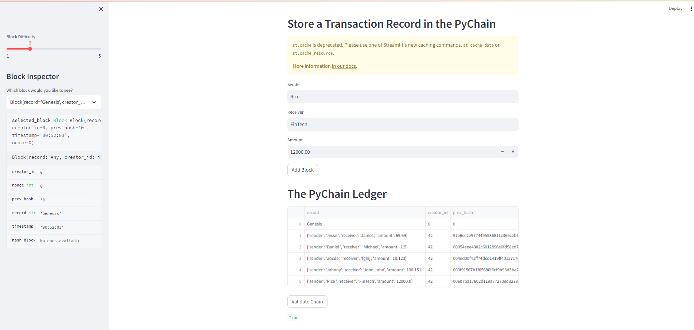

# Blockchain PyChain Ledger 

The following application is a simple application that stores transaction records within a PyChain. The Block's within the ledger contain a `sender`, a `receiver`, and an `amount`. 

The following screenshot shows a basic overhead view of the streamlit web-based application at initation. 

The second screenshow is a snapshot showing a pychain ledger with random examples of blocks showing various `senders`, `receivers`, & `amounts` to test and validation weather the pychain and the application is working as intended. 

